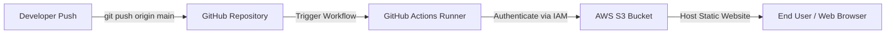
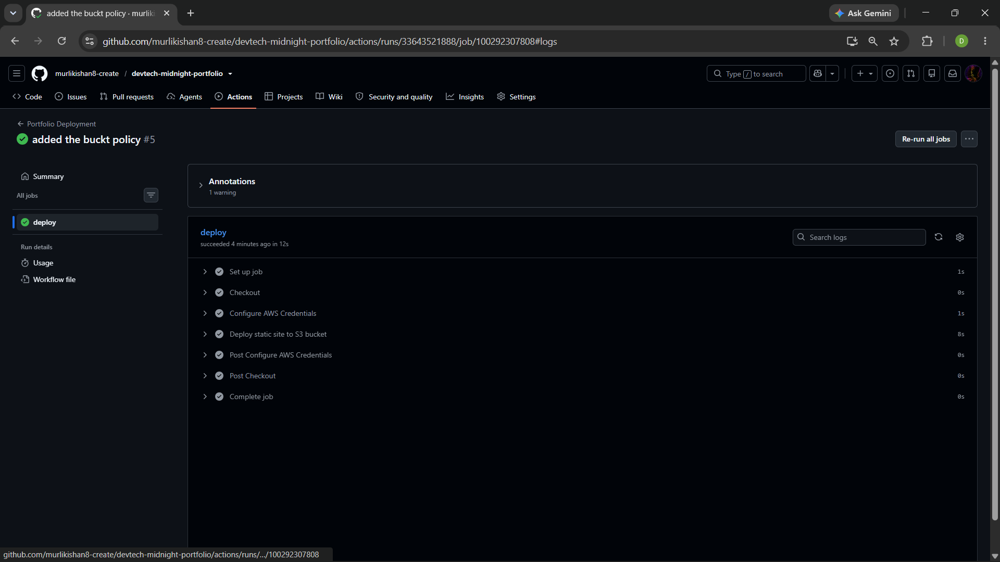
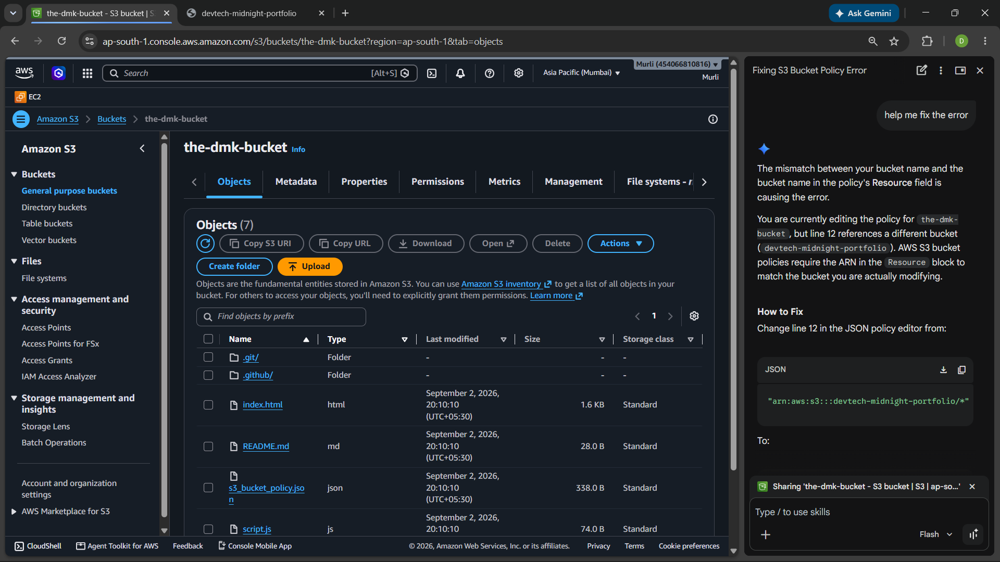
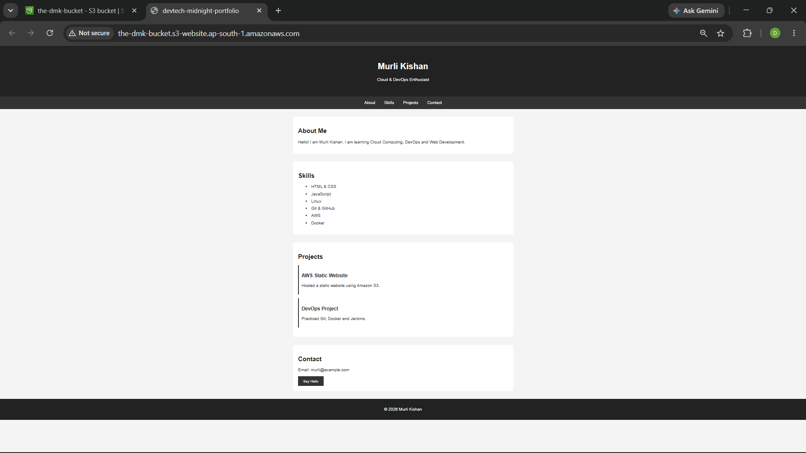
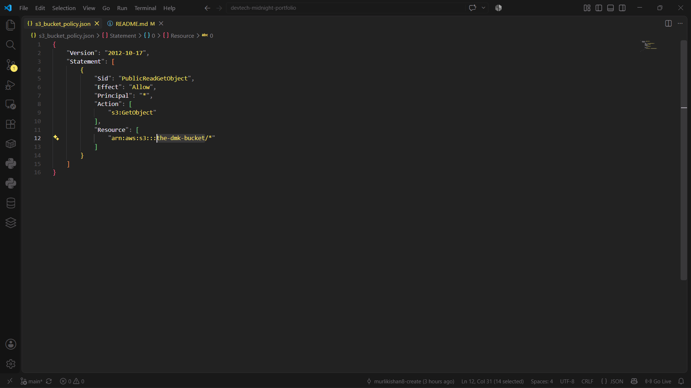
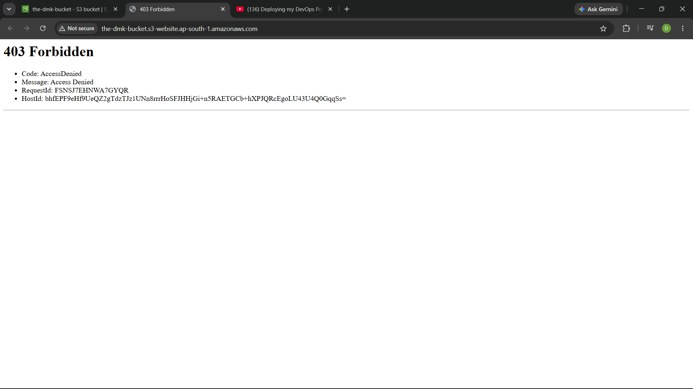

## AWS S3 Portfolio CI/CD Pipeline

## 📐 Architecture Overview



A portfolio website with **automated CI/CD deployment** using GitHub Actions and AWS S3.

## What It Does

Every time I push code to GitHub → GitHub Actions automatically deploys it to AWS S3 → Site updates instantly. No manual deployment needed.

## Why This Project?

Manual uploads to AWS S3 are slow and prone to human error. I built this project to automate deployments using GitHub Actions—ensuring every commit to `main` instantly updates the live site with zero manual effort.

## Tech Stack

- **Frontend**: HTML, CSS, JavaScript
- **CI/CD**: GitHub Actions
- **Hosting**: AWS S3
- **Version Control**: Git & GitHub

## How It Works

1. Push code to GitHub
2. GitHub Actions workflow triggers automatically
3. Syncs files to S3 bucket using `aws s3 sync`
4. Portfolio updates live instantly

## Setup Quick Steps

```bash
# 1. Create S3 bucket + enable Static Website Hosting
# 2. Create IAM credentials (AWS_ACCESS_KEY_ID, AWS_SECRET_ACCESS_KEY)
# 3. Add credentials to GitHub Secrets
# 4. Create .github/workflows/main.yml with:

name: Deploy to S3
on: [push]
jobs:
  deploy:
    runs-on: ubuntu-latest
    steps:
      - uses: actions/checkout@v3
      - uses: aws-actions/configure-aws-credentials@v2
        with:
          aws-access-key-id: ${{ secrets.AWS_ACCESS_KEY_ID }}
          aws-secret-access-key: ${{ secrets.AWS_SECRET_ACCESS_KEY }}
          aws-region: us-east-1
      - run: aws s3 sync . s3://your-bucket-name --delete

# 5. Add S3 bucket policy for public read access
# 6. Push code → Done! Auto deployed
```

## Key Features

 Fully automated deployment  
 Infrastructure as Code (YAML)  
 Secure credentials (GitHub Secrets)  
 Zero downtime updates  
 Cost-effective hosting  

## Troubleshooting

### Got 403 Forbidden Error?

**Problem**: Site shows "403 Forbidden" even though files are in S3

**Solution**:
1. Go to S3 Bucket → Permissions → **Block public access** → Uncheck all
2. Add **Bucket Policy**:
```json
{
  "Version": "2012-10-17",
  "Statement": [{
    "Effect": "Allow",
    "Principal": "*",
    "Action": "s3:GetObject",
    "Resource": "arn:aws:s3:::YOUR-BUCKET-NAME/*"
  }]
}
```
3. Refresh browser → works

**Why it happened**: Files uploaded but no public read permission 

### GitHub Actions Not Triggering?

- Check `.github/workflows/main.yml` exists in main branch
- Verify AWS secrets are added in GitHub Settings → Secrets
- Check GitHub Actions tab for error logs

### Files Not Updating in S3?

- Make sure you're pushing to `main` branch
- Check GitHub Actions tab - did workflow run successfully?
- Clear browser cache or try incognito mode

## Screenshots

### 1. GitHub Actions Workflow


### 2. S3 Bucket Files


### 3. Live Portfolio


### 4. Bucket Policy Configuration


### 5. 403 Error (Before Fix)



## What I Learned

- GitHub Actions automation
- AWS S3 bucket policy & permissions
- IAM security best practices
- Troubleshooting & debugging errors
- DevOps workflow
